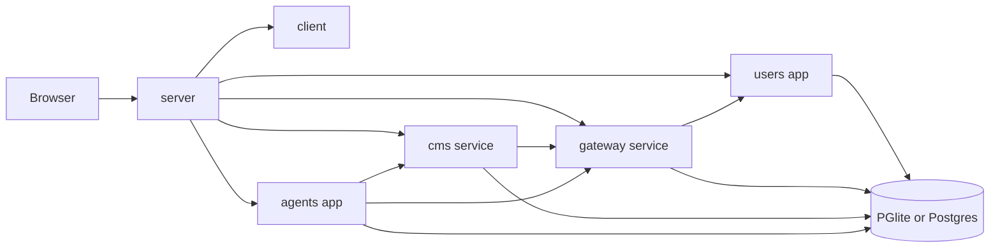
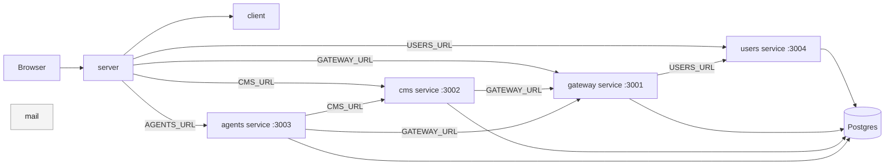
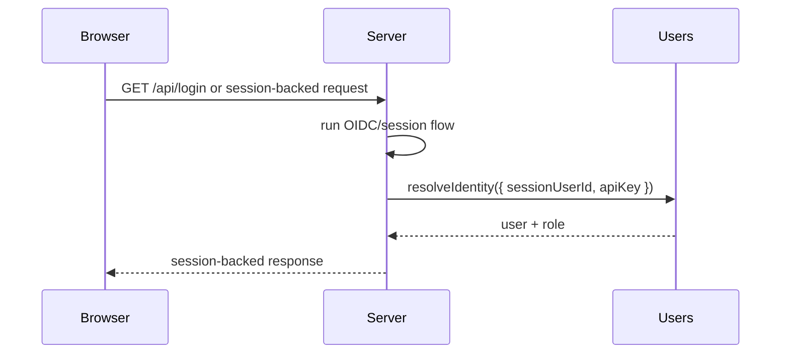
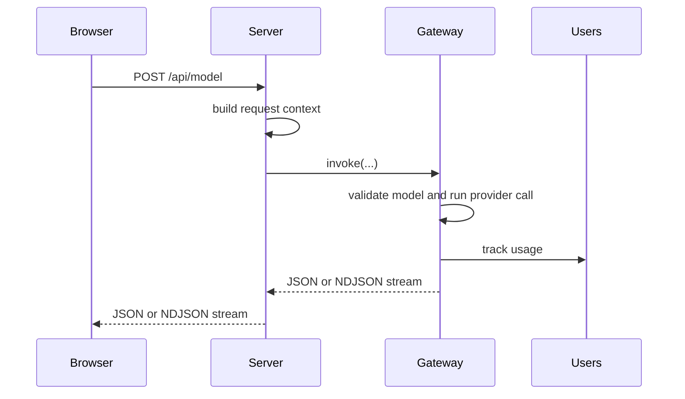
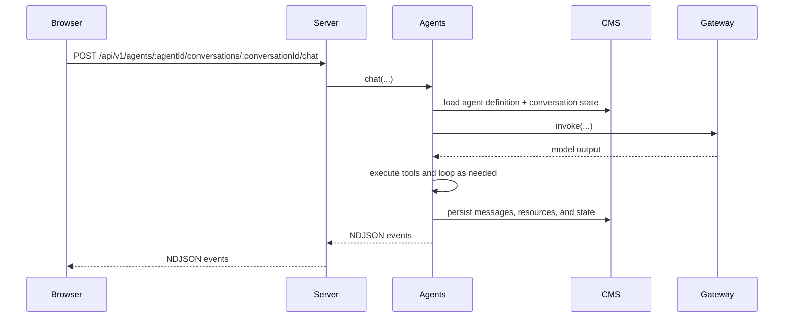

# Research Optimizer

Choose one development mode.

## Transport Parity

Any behavior change that crosses a package boundary must match in direct mode and HTTP mode.
When adding, removing, or changing methods, payloads, errors, or auth behavior, update the
in-process implementation, HTTP route surface, remote client, composition wiring, and parity
tests in the same change.

## Direct mode

Fastest way to work on the app locally.

```bash
npm install
cp server/.env.example server/.env
cp server/test.env.example server/test.env
npm start
```

Open `https://localhost`.

Use `npm run start:dev -w server` if you want auto-restart while editing.

```text
browser -> server
             |- users
             |- gateway
             |- cms
             `- agents
```

What this does:

- starts `server` at the repo root
- `server` composes `users`, `gateway`, `cms`, and `agents` in-process through `server/compose.js`
- keeps the service boundaries in code, but runs them in one Node process

Use this mode for most day-to-day backend work.

## Docker Compose mode

Closest local match to deployment, and the easiest way to get the full local dependency stack.

```bash
npm install
cp server/.env.example server/.env
docker compose up --build --watch
```

Open `https://localhost`.

```text
browser -> server -> users
                 -> gateway
                 -> cms
                 -> agents

plus:
  postgres
  mail
```

What this does:

- starts the full HTTP-shaped development stack from [docker-compose.yml](docker-compose.yml)
- runs `server`, `users`, `gateway`, `cms`, and `agents` as separate services
- starts `postgres` and `mail`
- uses Compose watch rules for sync/restart and rebuild during development

Use this mode when you want to stay close to the ECS deployment shape.

## Advanced HTTP mode

If you want real service-to-service HTTP locally without Docker, see [docs/architecture.md](docs/architecture.md).

That mode is supported, but it is not the zero-config path:

- each standalone service reads its own package-local `.env`
- all services need to share the same Postgres instance
- non-server services should set `DB_SKIP_SYNC=true` to match Docker Compose and ECS

## Important About Credentials

`server/.env.example` is only a starting point. Copy it to `server/.env`, then update the values for the features you want to use.

To run model inference locally, you need real AWS Bedrock credentials:

- `AWS_ACCESS_KEY_ID`
- `AWS_SECRET_ACCESS_KEY`
- usually `AWS_REGION`

Some other features also need real credentials or API keys, such as:

- `GEMINI_API_KEY`
- `BRAVE_SEARCH_API_KEY`
- email / SMTP settings

Without those values, the app may still start, but inference and some integrations will not work.

Expect a local HTTPS certificate warning in development.

## Workspace Layout

| Directory                         | Owns                                                                                                |
| --------------------------------- | --------------------------------------------------------------------------------------------------- |
| [client](client/)                 | frontend UI, served by `server`                                                                     |
| [server](server/)                 | the only public entrypoint; serves the client, handles auth/session, and mounts the API             |
| [users](users/)                   | users, roles, budgets, usage rows, analytics, and app config                                        |
| [gateway](gateway/)               | model inference, provider adapters, guardrails, and usage shaping                                   |
| [cms](cms/)                       | stored state for agent definitions, conversations, messages, resources, vectors, tools, and prompts |
| [agents](agents/)                 | runtime execution of an agent definition against a conversation                                     |
| [database](database/)             | shared schema, migrations, readiness, and seed data                                                 |
| [shared](shared/)                 | request context, middleware, logging, and common utilities                                          |
| [infrastructure](infrastructure/) | ECS/Fargate and Aurora deployment                                                                   |

Important distinction:

- `cms` stores what an agent is
- `agents` runs an agent

That is the biggest naming trap in the repo.

## Architecture

The browser only talks to `server`.

`server` is the front door for:

- HTTPS and static client files
- OIDC/session login
- edge-only routes like admin, search, translate, S3 access, and feedback
- mounting shared service-owned routers for chat, conversations, and model calls

The key composition file is [server/compose.js](server/compose.js):

- unset `USERS_URL`, `GATEWAY_URL`, `CMS_URL`, and `AGENTS_URL` to compose local modules directly
- set those URLs to switch `server` to the matching `remote.js` clients over HTTP

That is the dependency-injection model in this repo: composition happens at the edges, collaborators are passed in, and service `core/` code stays unaware of direct-vs-HTTP mode.

### Direct mode topology



This is the shape created by `server/compose.js` when the service URLs are unset.

### HTTP-shaped topology



This is the intended HTTP-shaped runtime:

- `server` uses remote clients when the service URLs are set
- `gateway` calls `users` over HTTP when `USERS_URL` is set
- `cms` calls `gateway` over HTTP when `GATEWAY_URL` is set
- `agents` calls `gateway` and `cms` over HTTP when `GATEWAY_URL` and `CMS_URL` are set

See [docs/architecture.md](docs/architecture.md) for a deeper breakdown of the advanced HTTP setup.

## Typical Request Flows

### Login and session



### Model call



### Chat



## Where To Make Changes

Use this map when deciding where to work.

- auth, session, browser-facing route behavior, static serving: `server`
- frontend UI and browser-only behavior: `client`
- user lookup, roles, budget logic, usage analytics: `users`
- provider logic, model invocation, guardrails, usage shaping: `gateway`
- stored agents, conversations, messages, resources, vectors, tools, prompts: `cms`
- runtime chat loop, tool execution, streaming behavior: `agents`

If you are changing stored agent metadata, that is `cms`.
If you are changing how an agent actually runs, that is `agents`.

## Directory Conventions

Service roots should show the runtime boundary, not hide it.

Common root files:

- `index.js`: standalone service entrypoint
- `app.js`: application-facing interface
- `http.js`: shared HTTP route composition
- `remote.js`: HTTP client for remote mode
- `service.js`: local composition helper when the service needs one
- `package.json`, `Dockerfile`, `README.md`, `openapi.yaml`

Common subdirectories:

- `core/`: business logic in `gateway`, `cms`, and `agents`
- `http/`: CMS route families and HTTP helpers
- `providers/`: external provider adapters in `gateway`
- `tools/`: tool implementations and specs in `agents`
- `api/`, `integrations/`, `runtime/`: edge API, external adapters, and process concerns in `server`
- `scripts/`: one-off operational scripts
- `test/`: service-local tests

Rule of thumb:

- if you are changing behavior, prefer `core/` or service-owned route files
- if you are changing startup wiring, go to `index.js`, `service.js`, or `server/compose.js`
- if you are changing transport behavior, go to `http.js` or `remote.js`

## Database And Startup

[database](database/) is a shared package, not a service.

When imported, it:

- uses PGlite if `PGHOST` is unset
- uses PostgreSQL if `PGHOST` is set
- runs `init.sql`
- applies checked-in migrations unless `DB_SKIP_SYNC=true`
- seeds reference data
- runs integrity checks unless disabled

Standalone services use [shared/service-app.js](shared/service-app.js) to expose `/health` and wait for schema readiness before serving traffic.

That means:

- direct mode is near-zero setup because it can use PGlite
- Docker Compose uses Postgres
- most services do not need manual schema setup for normal development

## Common Commands

```bash
npm start
npm run start:dev -w server
npm test
npm test -w server
npm test -w agents
npm run lint
npm run db
npm run db:sql
```

Most backend verification still lives under `server/test` because that suite exercises direct composition, mounted public routes, and direct-vs-HTTP transport parity.

## Package Docs

- [server/README.md](server/README.md)
- [users/README.md](users/README.md)
- [gateway/README.md](gateway/README.md)
- [cms/README.md](cms/README.md)
- [agents/README.md](agents/README.md)
- [database/README.md](database/README.md)
- [shared/README.md](shared/README.md)
- [infrastructure/README.md](infrastructure/README.md)
