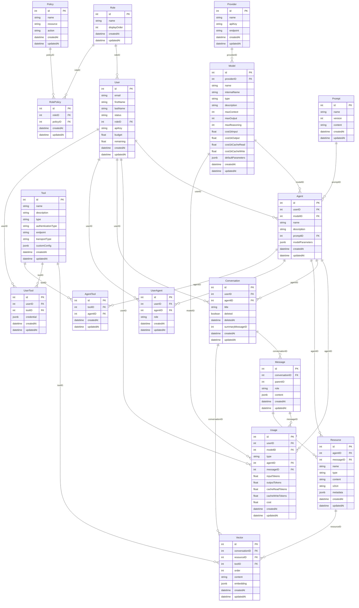

# database

Shared database package — Drizzle ORM schema, migrations, relations, and seed data.

## Overview

Workspace library package (not a running service). Imported by all services that need database access. Provides model definitions, association setup, and initial seed data loading.

## Quick Start

```js
import { User, Role, Model, Agent, Conversation, Message } from "database";
import { eq } from "drizzle-orm";
import db from "database";

const [user] = await db.select().from(User).where(eq(User.id, 1));
const conversations = await db.select().from(Conversation).where(eq(Conversation.userID, 1));
```

## Initialization Sequence

When imported, the package:

1. **Select dialect** — PGlite (when `DB_STORAGE` is set) or PostgreSQL (production)
2. **Create Drizzle instance** — Registers all table definitions and relations from `schema.js`
3. **Run migrations** (unless `DB_SKIP_SYNC=true`) — Applies Drizzle migrations via `migrate()`
4. **Seed data** — Upserts roles, policies, providers, models, prompts, agents, tools, and agent-tools from CSV files

Microservices that connect to an already-initialized database should set `DB_SKIP_SYNC=true`.

## Model Reference

All foreign keys use uppercase ID suffix (e.g., `userID`, `modelID`, `conversationID`).

| Model            | Key Attributes                                                                                                                                                                 | Indexes                                        |
| ---------------- | ------------------------------------------------------------------------------------------------------------------------------------------------------------------------------ | ---------------------------------------------- |
| **User**         | email, firstName, lastName, status, roleID, apiKey, budget, remaining                                                                                                          | email, roleID                                  |
| **Role**         | name, displayOrder                                                                                                                                                             | displayOrder                                   |
| **Policy**       | name, resource, action                                                                                                                                                         | —                                              |
| **RolePolicy**   | roleID, policyID                                                                                                                                                               | (roleID+policyID unique)                       |
| **Provider**     | name, apiKey, endpoint                                                                                                                                                         | —                                              |
| **Model**        | providerID, name, internalName, type, description, maxContext, maxOutput, maxReasoning, cost1kInput, cost1kOutput, cost1kCacheRead, cost1kCacheWrite, defaultParameters (JSON) | internalName, providerID                       |
| **Usage**        | userID, modelID, type, agentID, messageID, inputTokens, outputTokens, cacheReadTokens, cacheWriteTokens, cost                                                                  | userID, modelID, createdAt, (userID+createdAt) |
| **Prompt**       | name, version, content (TEXT)                                                                                                                                                  | name, (name+version unique)                    |
| **Agent**        | userID, modelID, name, description, promptID, modelParameters (JSON)                                                                                                           | userID, modelID, promptID                      |
| **Tool**         | name, description, type, authenticationType, endpoint, transportType, customConfig (JSON)                                                                                      | —                                              |
| **Conversation** | userID, agentID, title, deleted (BOOLEAN), deletedAt, summaryMessageID                                                                                                         | agentID, (userID+createdAt), deleted           |
| **Message**      | conversationID, parentID, role, content (JSON)                                                                                                                                 | conversationID, (conversationID+createdAt)     |
| **Resource**     | agentID, messageID, name, type, content (TEXT), s3Uri, metadata (JSON)                                                                                                         | agentID, messageID                             |
| **Vector**       | conversationID, resourceID, toolID, order, content (TEXT), embedding (JSON)                                                                                                    | conversationID, toolID, (resourceID+order)     |
| **UserAgent**    | userID, agentID, role                                                                                                                                                          | (userID+agentID unique)                        |
| **UserTool**     | userID, toolID, credential (JSON)                                                                                                                                              | (userID+toolID unique)                         |
| **AgentTool**    | toolID, agentID                                                                                                                                                                | (toolID+agentID unique)                        |

## Associations

```
User → Role (belongsTo)
Role → User (hasMany)

RolePolicy → Role, Policy (belongsTo)
Role, Policy → RolePolicy (hasMany)

Model → Provider (belongsTo)

Usage → User, Model, Agent, Message (belongsTo)
User, Model → Usage (hasMany)

Agent → Prompt, User (belongsTo)
Prompt, User → Agent (hasMany)

Conversation → User, Agent (belongsTo)
Agent → Conversation (hasMany)

Message → Conversation (belongsTo)
Conversation → Message (hasMany)

Resource → Agent, Message (belongsTo)
Agent → Resource (hasMany)

Vector → Conversation, Resource, Tool (belongsTo)
Conversation → Vector (hasMany)

UserAgent → User, Agent (belongsTo)
User, Agent → UserAgent (hasMany)

UserTool → User, Tool (belongsTo)
User, Tool → UserTool (hasMany)

AgentTool → Agent, Tool (belongsTo)
Agent, Tool → AgentTool (hasMany)
```

## Entity Relationship Diagram



## Data Ownership Matrix

Which service owns (writes) each model, and which services read it.

| Model                                          | Owner (writes)                   | Readers                    |
| ---------------------------------------------- | -------------------------------- | -------------------------- |
| User, Role                                     | server (auth/admin)              | gateway (rate limit check) |
| Policy, RolePolicy                             | seed data (read-only at runtime) | server (authorization)     |
| Provider, Model                                | seed data (read-only at runtime) | gateway (model lookup)     |
| Usage                                          | gateway (inference tracking)     | server (admin analytics)   |
| Prompt, Tool                                   | seed data + cms                  | cms (agent resolution)     |
| Agent, Conversation, Message, Resource, Vector | cms                              | server (via cms client)    |
| UserAgent, UserTool, AgentTool                 | cms                              | cms (junction lookups)     |

## Seed Data

Loaded from CSV files in `data/` via the CSV loader on startup:

| File                | Records | Notes                                                                  |
| ------------------- | ------- | ---------------------------------------------------------------------- |
| `roles.csv`         | 3       | admin, super user, user                                                |
| `policies.csv`      | 6       | Authorization policies (resource + action)                             |
| `role-policies.csv` | —       | Maps roles to policies                                                 |
| `providers.csv`     | 3       | bedrock, google (apiKey via `env:GEMINI_API_KEY`), mock                |
| `models.csv`        | 8       | Claude Opus/Sonnet/Haiku, Llama Maverick/Scout, Gemini Pro/Flash, Mock |
| `prompts.csv`       | 3       | References `file:prompts/ada.txt`, `fedpulse.txt`, `eagle.txt`         |
| `agents.csv`        | 3       | Standard Chat, FedPulse, EAGLE (all global: userID=null)               |
| `tools.csv`         | 7       | search, browse, code, editor, think, data, docxTemplate                |
| `agent-tools.csv`   | —       | Maps agents to tools via AgentTool junction                            |

A test admin user is created when `TEST_API_KEY` is set.

### CSV Loader Features

| Feature               | Syntax                          | Example                                  |
| --------------------- | ------------------------------- | ---------------------------------------- |
| Quoted fields         | `"value with, commas"`          | `"[{""key"":""val""}]"`                  |
| Null values           | `null`                          | `null` → `null`                          |
| File references       | `file:relative/path`            | `file:prompts/ada.txt` → file contents   |
| Environment variables | `env:VAR_NAME`                  | `env:GEMINI_API_KEY` → process.env value |
| JSON auto-detection   | Values starting with `[` or `{` | `[""a""]` → `["a"]`                      |
| Numeric auto-casting  | Numeric strings                 | `0.005` → `0.005`                        |

File references are resolved relative to the CSV file's directory.

## Exports

```js
// Named model exports
import {
  User,
  Role,
  Policy,
  RolePolicy,
  Provider,
  Model,
  Prompt,
  Agent,
  Conversation,
  Message,
  Tool,
  Resource,
  Vector,
  UserAgent,
  UserTool,
  AgentTool,
  Usage,
} from "database";

// Default export: Drizzle instance
import db from "database";
```

From `schema.js`:

- Table definitions (`User`, `Role`, `Policy`, etc.) — Drizzle `pgTable` objects
- Relation definitions (`userRelations`, `roleRelations`, etc.) — Drizzle `relations()` objects
- `tables` — Object containing all table references for iteration
- `seedDatabase(db)` — Loads CSVs and upserts seed data

## Configuration

| Variable       | Required | Default  | Description                                       |
| -------------- | -------- | -------- | ------------------------------------------------- |
| `DB_STORAGE`   | No       | —        | PGlite data directory (uses embedded PG when set) |
| `DB_SKIP_SYNC` | No       | false    | Skip schema sync and seed (for microservices)     |
| `PGHOST`       | Prod     | —        | PostgreSQL host                                   |
| `PGPORT`       | No       | 5432     | PostgreSQL port                                   |
| `PGDATABASE`   | No       | postgres | PostgreSQL database                               |
| `PGUSER`       | Prod     | —        | PostgreSQL user                                   |
| `PGPASSWORD`   | Prod     | —        | PostgreSQL password                               |
| `TEST_API_KEY` | No       | —        | Creates test admin user                           |
