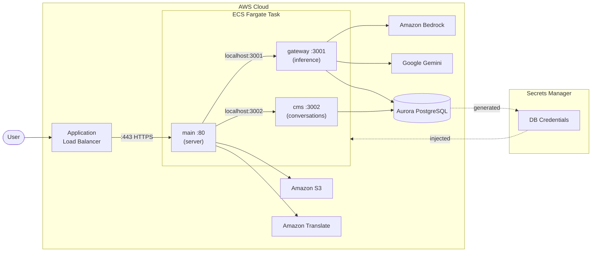
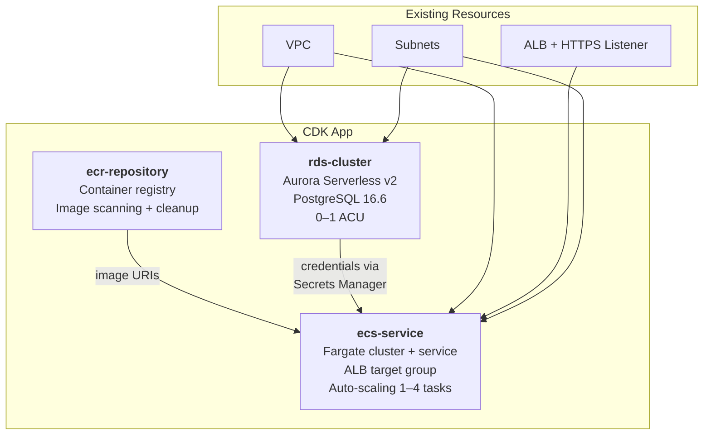
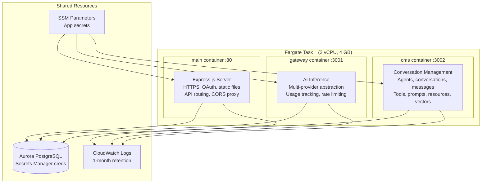
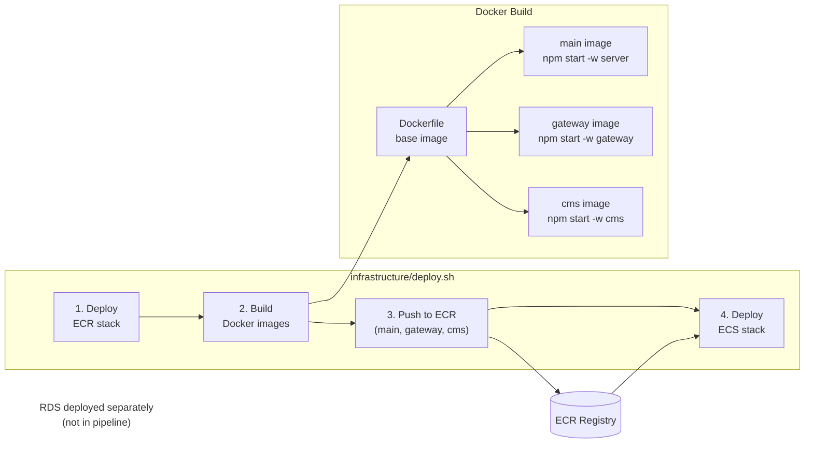

# infrastructure

AWS CDK v2 (Python) infrastructure for deploying the Research Optimizer platform.

## Architecture

### System Overview



### CDK Stacks



### ECS Task Containers



### Deployment Pipeline



## Overview

Three CDK stacks deploy the application to AWS:

| Stack                     | Resource    | Description                                      |
| ------------------------- | ----------- | ------------------------------------------------ |
| `{prefix}-ecr-repository` | ECR         | Docker image registry with auto-cleanup          |
| `{prefix}-ecs-service`    | ECS Fargate | 3-container task (main, gateway, cms) behind ALB |
| `{prefix}-rds-cluster`    | RDS Aurora  | Serverless v2 PostgreSQL                         |

The `prefix` is `{NAMESPACE}-{APPLICATION}-{TIER}` (e.g., `ctri-research-optimizer-dev`).

## Prerequisites

- Python 3.9+
- AWS CDK v2 (`npm install -g aws-cdk`)
- AWS CLI configured with appropriate credentials
- CDK bootstrap completed in target account
- Existing ALB with HTTPS listener tagged `Name={TIER}`

## Quick Start

```bash
cd infrastructure
pip install -r requirements.txt
cp .env.example .env   # Configure environment variables
cdk diff               # Preview changes
cdk deploy --all       # Deploy all stacks
```

## Configuration

Configuration is loaded from environment variables via `config.py`.

### Required Variables

| Variable          | Description                                       |
| ----------------- | ------------------------------------------------- |
| `AWS_ACCOUNT_ID`  | AWS account ID                                    |
| `AWS_REGION`      | AWS region                                        |
| `VPC`             | VPC name (looked up by name, not ID)              |
| `SUBNETS`         | Comma-separated subnet IDs                        |
| `NAMESPACE`       | Resource namespace (e.g., `ctri`)                 |
| `APPLICATION`     | Application name (e.g., `research-optimizer`)     |
| `TIER`            | Environment tier (e.g., `dev`, `staging`, `prod`) |
| `DOMAIN_NAME`     | Application domain name                           |
| `ALT_DOMAIN_NAME` | Optional alternate domain (redirects to primary)  |

### Container Images

| Variable        | Description                                                                  |
| --------------- | ---------------------------------------------------------------------------- |
| `MAIN_IMAGE`    | Main server container image URI (falls back to `SERVER_IMAGE`, then `httpd`) |
| `GATEWAY_IMAGE` | Gateway service container image URI (falls back to `httpd`)                  |
| `CMS_IMAGE`     | CMS service container image URI (falls back to `httpd`)                      |

### Application Secrets

Stored as SSM Parameters, injected into containers at runtime:

| Variable               | Container | Description                  |
| ---------------------- | --------- | ---------------------------- |
| `SESSION_SECRET`       | main      | Cookie signing secret        |
| `OAUTH_CLIENT_ID`      | main      | OIDC client ID               |
| `OAUTH_CLIENT_SECRET`  | main      | OIDC client secret           |
| `OAUTH_CALLBACK_URL`   | main      | OIDC redirect URI            |
| `OAUTH_DISCOVERY_URL`  | main      | OIDC discovery URL           |
| `GEMINI_API_KEY`       | gateway   | Google Gemini API key        |
| `BRAVE_SEARCH_API_KEY` | main      | Brave Search API key         |
| `DATA_GOV_API_KEY`     | main      | GovInfo API key              |
| `CONGRESS_GOV_API_KEY` | main      | Congress.gov API key         |
| `S3_BUCKETS`           | main      | Allowed S3 buckets           |
| `EMAIL_ADMIN`          | main      | Admin notification email     |
| `EMAIL_DEV`            | main      | Developer error report email |
| `EMAIL_USER_REPORTS`   | main      | User feedback email          |
| `SMTP_HOST`            | main      | SMTP server host             |
| `SMTP_PORT`            | main      | SMTP server port             |
| `SMTP_USER`            | main      | SMTP username                |
| `SMTP_PASSWORD`        | main      | SMTP password                |

Database credentials (PGHOST, PGUSER, PGPASSWORD, PGPORT, PGDATABASE) are pulled from Secrets Manager, created by the RDS stack. They are injected into all 3 containers.

### Auto-injected Environment Variables

These are set automatically by config.py (not user-configurable):

| Variable       | Container    | Value                    |
| -------------- | ------------ | ------------------------ |
| `PORT`         | main         | `80`                     |
| `PORT`         | gateway      | `3001`                   |
| `PORT`         | cms          | `3002`                   |
| `GATEWAY_URL`  | main         | `http://localhost:3001`  |
| `CMS_URL`      | main         | `http://localhost:3002`  |
| `DB_SKIP_SYNC` | gateway, cms | `true`                   |
| `VERSION`      | main         | `GITHUB_SHA` or `latest` |
| `TIER`         | main         | Environment tier         |

## Stack Details

### ECR Repository

- Creates container registry named `{prefix}`
- Enables image scanning on push
- Auto-deletes untagged images older than 10 days

### ECS Service

- **Task definition:** 2 vCPU, 4 GB memory
- **Containers:** 3 per task (main:80, gateway:3001, cms:3002)
- **Networking:** Same task = same network namespace (containers communicate via localhost)
- **Load balancer:** Attaches to existing ALB via listener lookup (matched by `Name={TIER}` tag)
- **Autoscaling:** 1–4 tasks, 70% CPU/memory target
- **Logging:** CloudWatch with 1-month retention

IAM permissions granted to tasks:

- Amazon Bedrock (AI inference)
- Amazon RDS Data API
- Secrets Manager
- Amazon Translate, Polly
- Amazon S3
- Amazon EFS
- AWS Marketplace

### RDS Cluster

- Aurora Serverless v2, PostgreSQL 16.6
- Auto-scales 0–1 ACU (configurable via `minCapacity`/`maxCapacity`)
- 7-day backup retention
- Data API enabled
- Credentials stored in Secrets Manager

## Docker Image Strategy

All services share a single base `Dockerfile` at the project root. Service-specific images override only the `CMD`:

```
Dockerfile      → main image    (CMD: npm start -w server)
gateway/Dockerfile → gateway image (FROM main, CMD: npm start -w gateway)
cms/Dockerfile  → cms image     (FROM main, CMD: npm start -w cms)
```

## CI/CD Pipeline

The `infrastructure/deploy.sh` script orchestrates deployment:

1. Deploy ECR stack
2. Build and push 3 Docker images (main, gateway, cms)
3. Deploy ECS stack

Note: RDS deployment is handled separately (not part of the automated pipeline).

### Local Deployment

```bash
# Prerequisites: Docker, Python 3.9+, AWS CDK, Node.js, AWS SSO login
cd infrastructure
cp .env.example .env   # Fill in values (see .env.example for reference)

# Authenticate with AWS
aws sso login --profile <your-profile>
export AWS_PROFILE=<your-profile>

# Run deployment
bash deploy.sh
```

### CI/CD Deployment

Pushes to `*dev` or `*qa` branches trigger the GitHub Actions deploy workflow, which injects `infrastructure/.env` from the `ENV_FILE` repository secret.

## Deployment Order

For a fresh deployment:

1. `{prefix}-ecr-repository` — Create container registry
2. Push Docker images to ECR
3. `{prefix}-rds-cluster` — Create database (generates credentials in Secrets Manager)
4. `{prefix}-ecs-service` — Deploy application containers

## CDK Bootstrap

Before first deployment, bootstrap CDK in your account:

```bash
cdk bootstrap aws://ACCOUNT_ID/REGION \
  --qualifier hnb659fds \
  --cloudformation-execution-policies arn:aws:iam::aws:policy/AdministratorAccess \
  --trust ACCOUNT_ID
```

## Commands

```bash
cdk diff                    # Preview changes
cdk synth                   # Generate CloudFormation templates
cdk deploy --all            # Deploy all stacks
cdk deploy {prefix}-ecs-service  # Deploy specific stack
cdk destroy --all           # Destroy all stacks (use with caution)
```
